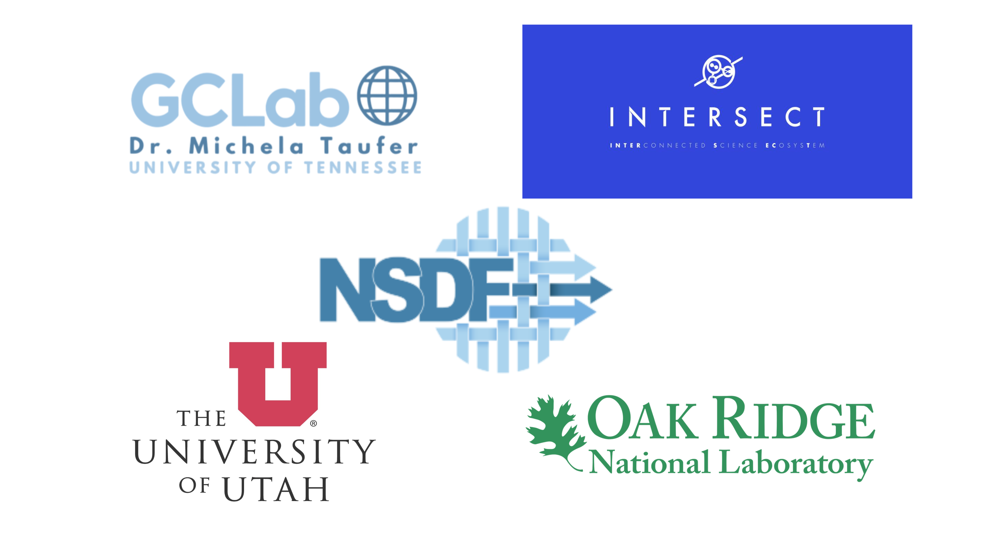

<p align="center">
    
</p>
<p align="center">
 <a href="https://www.python.org/downloads/release/python-310/"></a>
 <a href="https://www.docker.com"></a>
 
 
</p>

# NSDF-INTERSECT

This repository hosts the dashboard, dashboard service, storage service, and test clients for the [NOMAD experiment Fe2O3](https://docs.google.com/document/d/1wsDgHqE7Mg6-hM07lKuhoV7-m2mvKDEZ/edit).

#### Table of Contents

- [Dashboard](#-dashboard)
  - [Building dashboard image](#building-the-dashboard-image)
  - [Running the dashboard container](#running-the-dashboard-container)
- [Dashboard Service](#-dashboard-service)
  - [Building dashboard service image](#building-the-dashboard-service-image)
  - [Running the dashboard service container](#running-the-dashboard-service-container)
- [Storage Service](#-storage-service)
  - [Building storage service image](#building-the-storage-service-image)
  - [Running the storage service container](#running-the-storage-service-container)
- [Testing Clients](#-testing-with-the-client)
  - [Single file client](#single_clientpy)
  - [Real-time client](#realtime_clientpy)
  - [Transition client](#transition_clientpy)
- [Running all services](#-running-all-services)
- [Running with pre-built images](#running-with-pre-built-images)
- [Authors](#authors)
- [Acknowledgements](#acknowledgements)

## 📈 Dashboard

The dashboard is the visualization component for monitoring the experiment in real-time.

### 🐳 Docker

#### Building the dashboard image

To build the Docker image for the dashboard, run the following:

```bash
docker build --platform linux/amd64 -t intersect-dashboard -f Dockerfile.dashboard .
```

#### Running the dashboard container

To run the Docker container for the dashboard, execute the following:

```bash
docker run --rm -p 10042:10042 intersect-dashboard
```

## 🖥️ Dashboard service

The dashboard service uses [intersect-sdk](https://github.com/INTERSECT-SDK/python-sdk) to enable endpoints that work with message brokers (i.e RabbitMQ).
The service will include three endpoints to serve the dashboard component: `get_bragg_data`, `get_transition_data`, and `get_next_temperature`.

### 🐳 Docker

#### Building the dashboard service image

To build the Docker image for the service, run the following:

```bash
docker build -t intersect-service -f Dockerfile.dashboard_service .
```

#### Running the dashboard service container

To run the Docker container for the service, execute the following:

```bash
docker run --rm -p 10043:10043 intersect-service
```

## 📦 Storage service

The storage service interfaces with Scientist Cloud to persist the data that is received. For running this service, credentials specified in [.env.example](./.env.example)

### 🐳 Docker

#### Building the storage service image

To build the Docker image for the storage service, run the following:

```bash
docker build -t intersect-storage -f Dockerfile.storage_service .
```

#### Running the storage service container

To run the Docker container for the storage service, execute the following:

```bash
docker run --rm -p 10044:10044 intersect-storage
```

## 🧪 Testing with the client

To test the networking of the service and the observer on the dashboard, we can use intersect-sdk to create clients that serve the purpose of simulating
the traffic through the message broker. We have two clients.

### single_client.py

This is a simple client that sends only one file.

To run this client make sure you have the service running, then you can execute the following:

- For bragg data

```bash
python clients/single_client.py --bragg
```

- For transition data

```bash
python clients/single_client.py --transition
```

- For next temperature data

```bash
python clients/single_client.py --next-temp --val 30.0
```

### realtime_client.py

This is a client that implements a message stack with different events (get_bragg_data, get_transition_data, get_next_temperature) and wait times, in order to simulate a real-time stream of events. More information
on this type of client here [counting example](https://intersect-python-sdk.readthedocs.io/en/latest/examples/counting.html).

To run this client make sure you have the service running, then you can execute the following:

```bash
python clients/realtime_client.py
```

### transition_client.py

This is a client that implements a message stack for testing the transition plot. The transition plot receives the type TransitionData which contains a campaign ID, temperature, and a variable size y-list.
The client can simulate a full campaign for the transition plot via its two arguments `--n` for number of points `--ny` for y-list length as follows.

```bash
# default --n is 10 --ny is 3
python clients/transition_client.py
```

```bash
python clients/transition_client.py --ny 5
```

## 📦 Running all services

Prerequisites: make sure to build the [intersect-dashboard](#building-the-dashboard-image) image and the [intersect-service](#building-the-dashboard-service-image) image.

To run all the services, you can use the `compose_local.yaml` file to run the broker, the dashboard, and the service.

```bash
docker compose -f compose_local.yaml up -d
```

To stop and clean up the services.

```bash
docker compose -f compose_local.yaml down
```

## Running with pre-built images

If you would like to get the images from the github registry, you can follow these steps:

1. If you are not logged into the ghcr, login into github registry with the following command:

```bash
docker login ghcr.io -u <your-gh-username> -p <your-pat>
```

2. Pull the pre-built dashboard, dashboard service, and storage service image

```bash
docker pull ghcr.io/nsdf-fabric/intersect-dashboard:latest
docker pull ghcr.io/nsdf-fabric/intersect-service:latest
docker pull ghcr.io/nsdf-fabric/intersect-storage:latest
```

3. Run all services with `compose.yaml`

```bash
docker compose up -d
```

To stop and clean up the services.

```bash
docker compose down
```

## Authors

This project was created by the [NSDF team](https://nationalsciencedatafabric.org/contributors.html), and the [INTERSECT team](https://www.ornl.gov/intersect).
To reach out email us at info@nationalsciencedatafabric.org and Dr. Michela Taufer mtaufer@utk.edu.

## Acknowledgements

The authors would like to express the gratitude to:

- NSF through the awards 2138811, 2103845, 2334945, 2138296, and 2331152.
- VisStore/ ScientistCloud [link](https://www.visoar.net/)
- The Seal Storage Team [link](https://sealstorage.io/)
